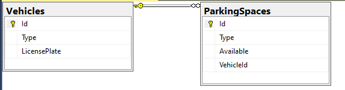
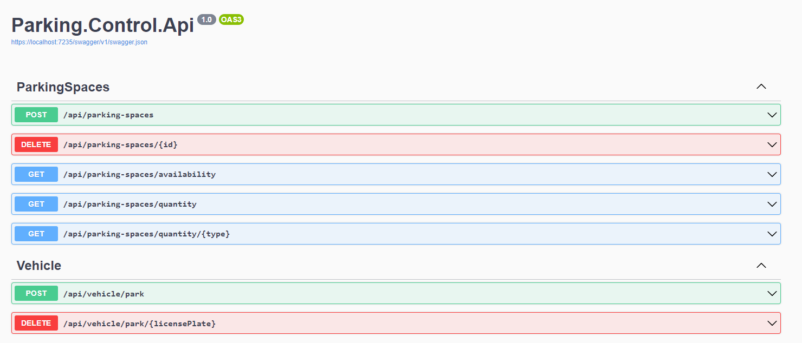
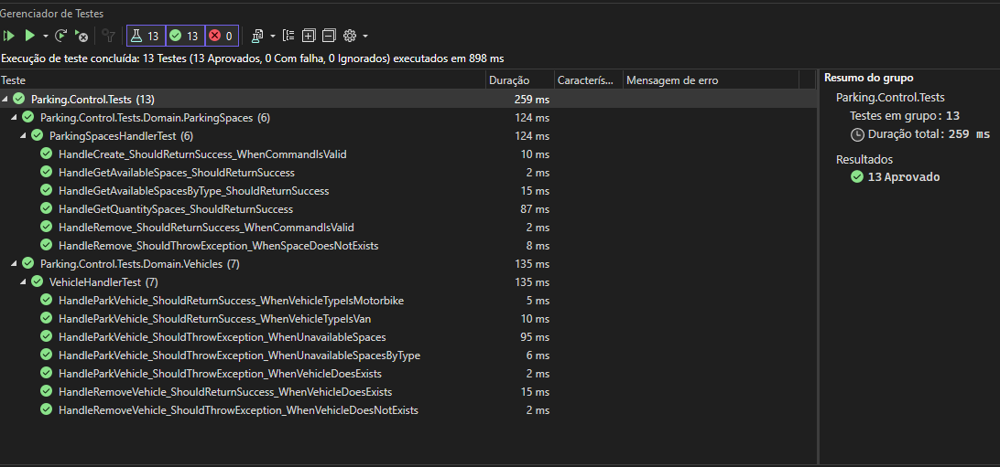

# Parking.Control.Api
Api para controle de estacionamento onde:

O estacionamento deve ter três tipos de vagas:

- Vagas para motos
- Vagas para carros
- Vagas grandes

Considere que o estacionamento irá aceitar três tipos de veiculos:

- motos
- carros
- vans

Dito isso, deve-se seguir as seguintes regras:

- Uma moto pode estacionar em qualquer lugar
- Um carro pode estacionar em uma única vaga para carro, ou em uma vaga grande
- Uma van pode estacionar, mas ocupará 3 vagas de carro, ou uma vaga grande

Para a solução do problema, foi utilizada duas tabelas na base de dados que consiste em:

Basicamente, os veiculos estacionados ficarão salvos na tabela Vehicles, enquanto a tabela ParkingSpaces irá acomodar informações sobre a vaga e também o Id do veiculo estacionado. Sendo assim, é possível termos uma Van ocupando 3 vagas.

A solução também tem priorização de vagas, priorizando a vaga relacionada ao tipo do veiculo e caso não encontre, buscará a segunda opção aceitável.

Rotas acessíveis:

Testes unitários:

A Solução está estruturada em uma arquitetura orientada a dominio prezando o modelo CQRS, onde devemos sogregar as responsabilidades de leitura e escrita no banco de dados.

Para testes, poderá utilizar o bkp da base de dados disponibilizada em /assets.

Tecnologias utilizadas:

- .NET 7
- DDD
- EntityFrameworkCore
- Sql Server
- MediatoR
- AutoMapper
- CQRS
- XUnit
- FluentAssertions
- MOQ

